```
   ██████╗ ███████╗███╗   ██╗ ██████╗ ███╗   ███╗███████╗██╗ ██████╗ 
  ██╔════╝ ██╔════╝████╗  ██║██╔═══██╗████╗ ████║██╔════╝██║██╔═══██╗
  ██║  ███╗█████╗  ██╔██╗ ██║██║   ██║██╔████╔██║█████╗  ██║██║   ██║
  ██║   ██║██╔══╝  ██║╚██╗██║██║   ██║██║╚██╔╝██║██╔══╝  ██║██║▄▄ ██║
  ╚██████╔╝███████╗██║ ╚████║╚██████╔╝██║ ╚═╝ ██║███████╗██║╚██████╔╝
   ╚═════╝ ╚══════╝╚═╝  ╚═══╝ ╚═════╝ ╚═╝     ╚═╝╚══════╝╚═╝ ╚══▀▀═╝ 
   ██████╗ ███╗   ██╗ █████╗      ██████╗██╗      █████╗ ███████╗███████╗██╗███████╗██╗███████╗██████╗ 
   ██╔══██╗████╗  ██║██╔══██╗    ██╔════╝██║     ██╔══██╗██╔════╝██╔════╝██║██╔════╝██║██╔════╝██╔══██╗
   ██║  ██║██╔██╗ ██║███████║    ██║     ██║     ███████║███████╗███████╗██║█████╗  ██║█████╗  ██████╔╝
   ██║  ██║██║╚██╗██║██╔══██║    ██║     ██║     ██╔══██║╚════██║╚════██║██║██╔══╝  ██║██╔══╝  ██╔══██╗
   ██████╔╝██║ ╚████║██║  ██║    ╚██████╗███████╗██║  ██║███████║███████║██║██║     ██║███████╗██║  ██║
   ╚═════╝ ╚═╝  ╚═══╝╚═╝  ╚═╝     ╚═════╝╚══════╝╚═╝  ╚═╝╚══════╝╚══════╝╚═╝╚═╝     ╚═╝╚══════╝╚═╝  ╚═╝
```

# 🧬 GenomeIQ — DNA Disease Classifier

### *Explainable AI for Genomic Disease Detection — Powered by TF-IDF Ensemble + DNABERT-2 Transformer + RAG Copilot*

> **An end-to-end, multi-modal DNA disease classification platform.**
> Predicts Cancer, Diabetes, Alzheimer's, or Normal markers from raw DNA sequences using a hybrid of classical machine learning and a fine-tuned genomic transformer (DNABERT-2).
> Features explainable saliency maps, out-of-distribution detection, BLAST-lite similarity search, mutation impact analysis, and a RAG-powered chat assistant grounded in a curated genomic knowledge base.

[](#)
[](#)
[](#license)
[](#)
[](#)
[](#)
[](#)

---

## 🎬 Demo Video

[](https://youtu.be/jEPU8YnJC3I)

**▶ [Watch Full Demo on YouTube](https://youtu.be/jEPU8YnJC3I)**

> *(Replace `YOUR_YOUTUBE_ID_HERE` with the actual video ID once uploaded.)*

---

## 🖼️ Application Hero

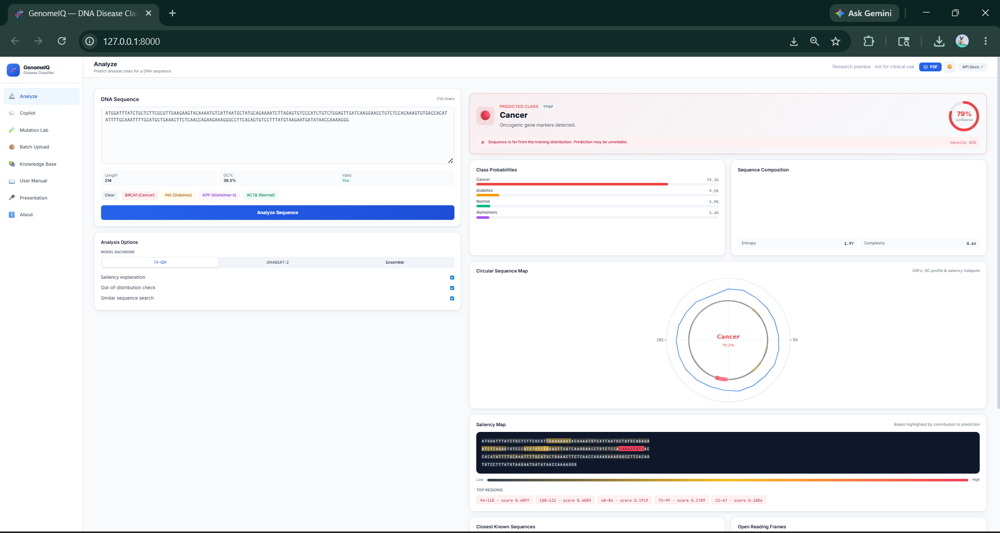

> *Full prediction view: verdict card with confidence gauge, OOD risk banner, per-class probability bars, sequence composition doughnut, and the start of the saliency map.*

---

## 📸 What You Get

GenomeIQ ships with a complete clinical-style web interface. Below is a tour of the major capabilities — every feature is fully implemented and runs locally.

---

### 🔬 1. Prediction with Explainability

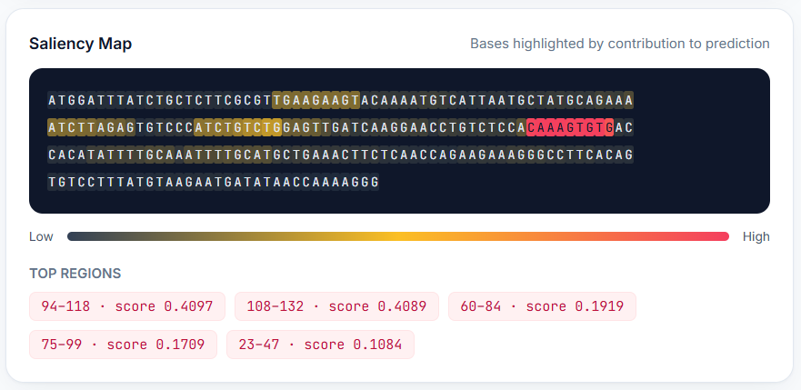

> Paste a DNA sequence and the classifier returns a verdict with **confidence gauge**, **per-class probabilities**, and a **per-base saliency heatmap** showing which nucleotides drove the decision. Built-in OOD detection flags inputs the model has never seen anything like.

---

### 🌀 2. Circular Sequence Map

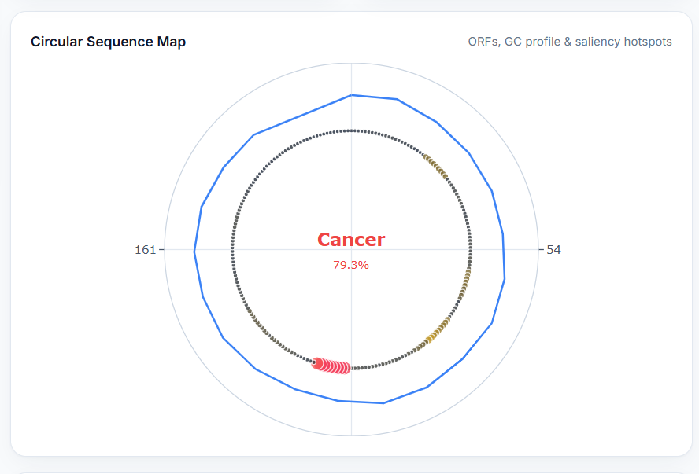

> Plotly-powered polar visualisation: outer ring = **GC content profile**, middle ring = **saliency hotspots**, inner rings = **forward (+) and reverse (−) ORFs**. The center displays the predicted class and confidence.

---

### 🎯 3. BLAST-Lite Similarity & ORFs

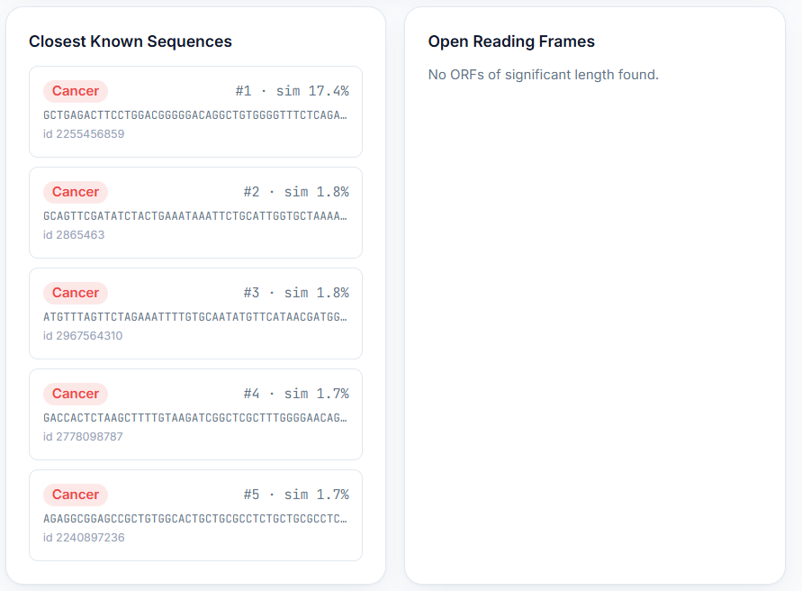

> Independent sanity check: the top-K most similar known training sequences are surfaced with their disease labels alongside detected ORFs across both strands and three reading frames.

---

### 💬 4. RAG Copilot (Genomics Chat Assistant)

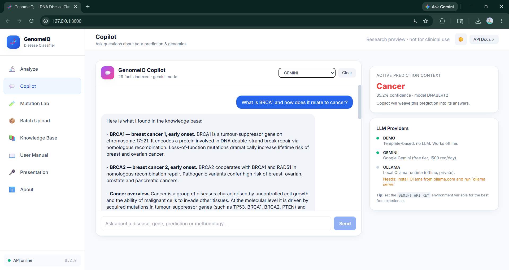

> A retrieval-augmented chatbot that answers genomics questions grounded in a **curated knowledge base of 29 facts** (4 diseases, 17 key marker genes, 5 methodology docs). Three free providers: **Demo** (offline templates), **Gemini 2.5 Flash** (Google free tier), and **Ollama** (local Llama). Each AI answer cites its sources.

---

### 🧪 5. Mutation Impact Analyser

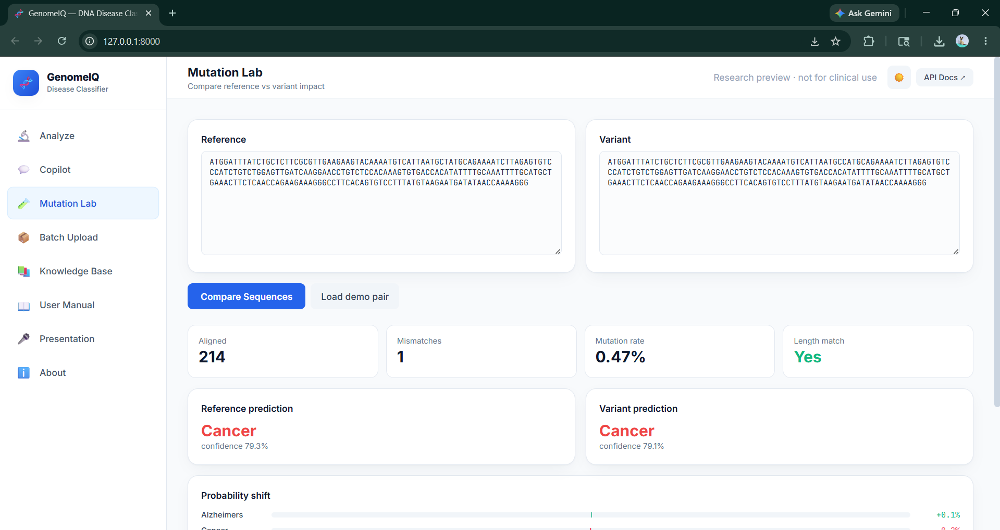

> Compare a reference and a variant sequence. The tool aligns them base-by-base, classifies every mismatch as **synonymous / missense / nonsense / stop-loss**, and shows how each disease probability shifts between the two sequences.

---

### 📦 6. Batch FASTA Upload

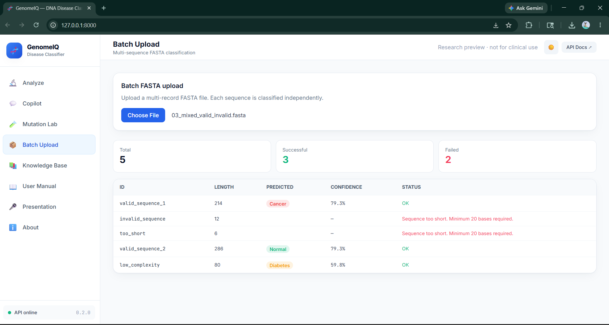

> Upload a multi-record FASTA file and classify every sequence at once. Results appear in a sortable table with confidence and status per record.

---

### 📚 7. Knowledge Base

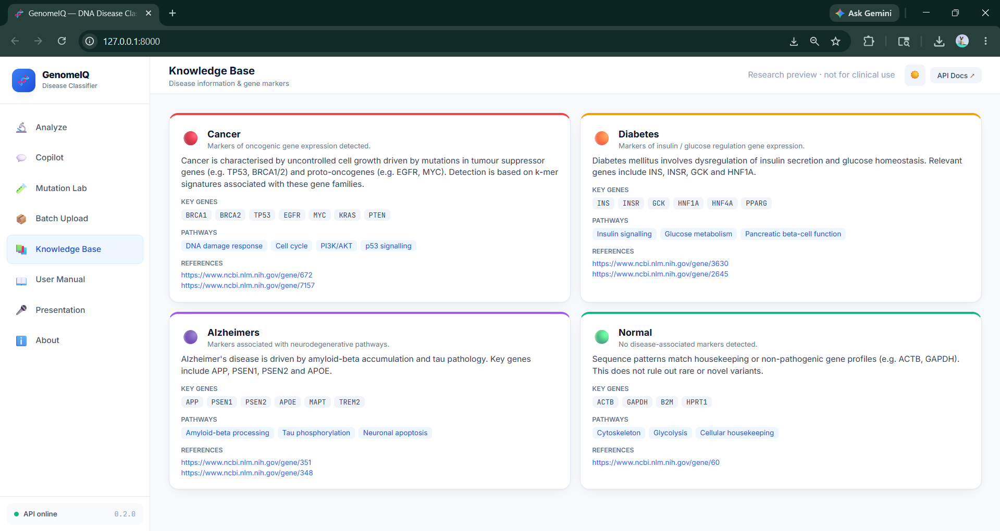

> Reference cards for each disease class with descriptions, marker genes, biological pathways, and direct NCBI Gene links.

---

### 📄 8. PDF Report Export

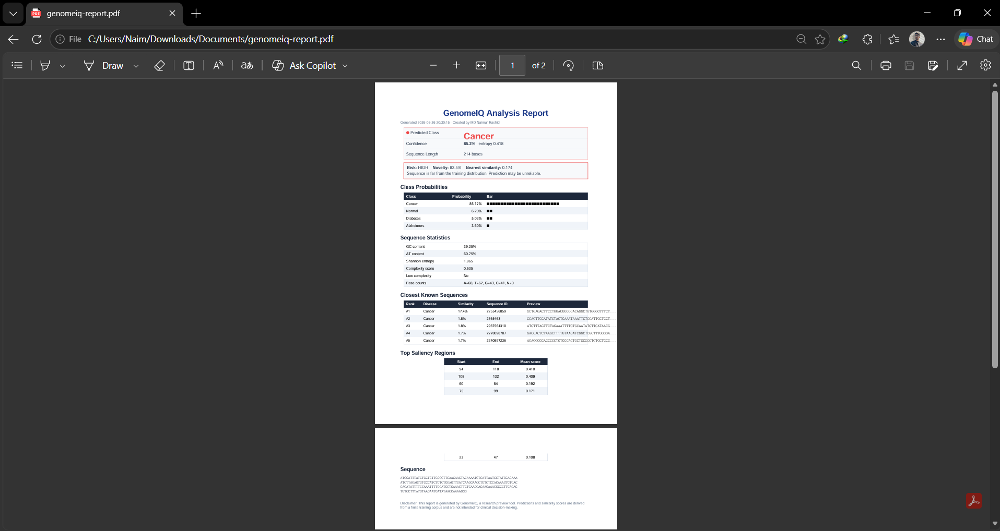

> Single-click ReportLab PDF with the full verdict, OOD risk, probability table, sequence statistics, similar hits, ORFs, top saliency regions and the input sequence — formatted for sharing or attaching to a thesis.

---

### 🌙 9. Dark Mode

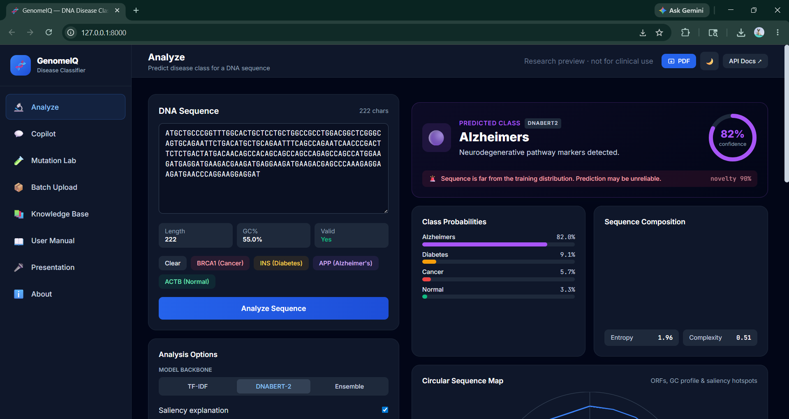

> System-aware theme toggle with smooth transitions. Charts and the circular plot re-render with theme-appropriate colors. Choice persists in `localStorage`.

---

### 📖 10. In-App User Manual

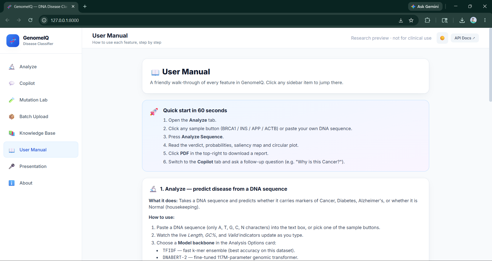

> Step-by-step guide for every feature, built directly into the UI. Collapsible sections cover Analyze, Copilot, Mutation Lab, Batch, Knowledge Base, PDF report, dark mode, and limitations.

---

### 🎤 11. In-App Presentation Deck

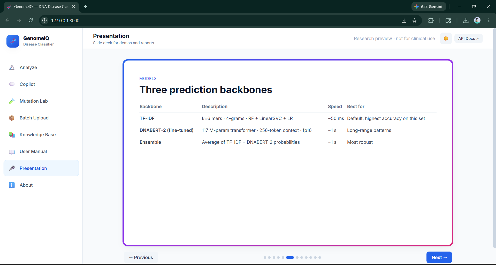

> A 12-slide deck embedded in the app (problem → solution → architecture → dataset → models → results → explainability → trust signals → RAG → tech stack → closing). Navigable with **arrow keys** or dot indicators — ready for demos and defenses.

---

## ✨ Features

| Feature | Description |
|---|---|
| 🧠 **Hybrid ML Architecture** | TF-IDF k-mer ensemble (RF + Linear SVM + LR) + fine-tuned DNABERT-2 transformer |
| 🔍 **Explainable AI** | Per-base saliency map + top contributing regions highlighted in real DNA characters |
| 🚨 **OOD Detection** | Flags inputs outside the training distribution using cosine-similarity thresholds |
| 🧬 **DNABERT-2 Backbone** | 117 M-parameter genomic transformer, fine-tunable on consumer GPUs (4 GB VRAM) |
| ⚖️ **Three Backbones in UI** | Switch live between TF-IDF, DNABERT-2 (fine-tuned) and an averaged Ensemble |
| 🔄 **Group-Aware Augmentation** | Sliding-window + reverse-complement expansion (808 → 22,848 samples) without leakage |
| 📈 **Cross-Validation Suite** | Stratified group K-fold + grid search over k and n-gram ranges |
| 🧪 **Mutation Lab** | Codon-level diff + AA effect categorisation + classifier probability shift |
| 💬 **RAG Copilot** | FAISS retrieval over curated KB, grounded LLM answers with cited sources |
| 🧰 **Multi-Provider LLM** | Gemini (free) · Ollama (local) · Demo (offline template) — pick at runtime |
| 🌀 **Circular Sequence Map** | Plotly polar visualisation of GC, saliency and ORFs |
| 🎯 **BLAST-Lite Search** | Top-K nearest known sequences as an independent sanity check |
| 📄 **PDF Report Export** | Single-click ReportLab PDF with verdict, stats, sources, ORFs and saliency regions |
| 🌙 **Dark Mode** | System-aware theme toggle with persistent localStorage |
| 📖 **In-App User Manual** | Step-by-step guide for every feature, built directly into the UI |
| 🎤 **In-App Presentation** | 12-slide deck, navigable with arrow keys, ready for demos and defenses |

---

## 🛠️ Tech Stack

| Layer | Technology |
|---|---|
| **Backend** | FastAPI · Uvicorn · Pydantic · Python 3.10 |
| **Classical ML** | scikit-learn (Random Forest · LinearSVC · Logistic Regression · CalibratedClassifierCV) |
| **Sequence Features** | TF-IDF on 4-grams of overlapping 6-mers |
| **Transformer** | PyTorch 2.6 (CUDA 12.4) · HuggingFace Transformers · DNABERT-2-117M |
| **Bioinformatics** | Biopython · custom k-mer / ORF / GC utilities |
| **Vector Search** | sentence-transformers (`all-MiniLM-L6-v2`) · FAISS |
| **LLM Providers** | Google Gemini 2.5 Flash · Ollama (Llama 3.2) · offline template |
| **PDF Reports** | ReportLab |
| **Frontend** | Tailwind CSS · Alpine.js · Chart.js · Plotly |
| **Hardware Tested** | NVIDIA RTX 3050 4 GB · CUDA 12.4 · Windows 11 |

---

## 📁 Project Structure

```
dna-disease-classifier/
│
├── README.md                      # This file
├── DOCS.md                        # Detailed technical documentation
├── requirements.txt               # Python dependencies
├── .env.example / .env / .gitignore
├── run code.txt                   # Quick command cheatsheet
│
├── 📁 data/
│   ├── 📁 raw/disease_sequences/  # Original CSV (808 sequences)
│   └── 📁 processed/              # Augmented parquet splits + audit reports
│
├── 📁 models/                     # All trained artifacts (gitignored)
│   ├── disease_classifier.pkl     # TF-IDF ensemble
│   ├── disease_vectorizer.pkl     # TF-IDF vectorizer
│   ├── disease_label_encoder.pkl
│   ├── 📁 dnabert2_base/          # Cached pretrained DNABERT-2
│   ├── 📁 dnabert2_finetuned/     # Fine-tuned classification head
│   ├── dnabert2_embeddings.npz    # Frozen embeddings cache
│   ├── similarity_index.npz       # BLAST-lite cosine index
│   ├── ood_stats.npz              # OOD threshold distribution
│   └── rag_index.faiss            # Knowledge-base FAISS index
│
├── 📁 src/
│   ├── 📁 core/                   # Config, sequence utils, knowledge base
│   ├── 📁 data/                   # Audit, dedup, augmentation, dataset builder
│   ├── 📁 ml/                     # Classifier, explain, OOD, similarity, mutation, DNABERT-2
│   ├── 📁 rag/                    # FAISS retriever, LLM providers, chat orchestration
│   ├── 📁 api/                    # FastAPI app, schemas, service, PDF report
│   ├── train.py                   # CLI to train TF-IDF ensemble
│   ├── eval.py                    # K-fold CV + hyperparameter grid search
│   ├── preprocess.py              # Processed-feature dump
│   └── predict.py                 # CLI predictor
│
├── 📁 frontend/
│   ├── index.html                 # Single-page app
│   └── 📁 static/                 # app.js + styles.css
│
├── 📁 notebooks/                  # Original exploration / training notebooks
└── 📁 app/                        # Legacy Streamlit prototype (kept for reference)
```

---

## 🚀 Getting Started

### Prerequisites

- **Python 3.10+**
- **NVIDIA GPU** (optional but recommended; project tested on RTX 3050 4 GB)
- **CUDA 12.4** drivers if using GPU
- **Free Google Gemini API key** (optional, for the Copilot's natural-language mode)

### 1. Clone the repository

```bash
git clone https://github.com/<your-handle>/dna-disease-classifier.git
cd dna-disease-classifier
```

### 2. Create a virtual environment

```bash
# Windows
python -m venv venv
venv\Scripts\activate

# Linux / macOS
python -m venv venv
source venv/bin/activate
```

### 3. Install dependencies

```bash
pip install -r requirements.txt

# GPU PyTorch (skip if CPU only)
pip install torch --index-url https://download.pytorch.org/whl/cu124
```

### 4. Configure secrets (optional)

Copy the env template and fill in your free Gemini key:

```bash
cp .env.example .env
# Then edit .env and set GEMINI_API_KEY=your_key_here
```

Get a free key at [aistudio.google.com/apikey](https://aistudio.google.com/apikey) (1500 requests/day, no credit card needed).

### 5. Run the web app

```bash
uvicorn src.api.app:app --reload --port 8000
```

Open **http://127.0.0.1:8000** in your browser. The interactive Swagger API docs are at **http://127.0.0.1:8000/docs**.

---

## ⚙️ How It Works

```
DNA Sequence Input
        ↓
Sequence Validation — only A/T/G/C/N, length checks, complexity stats
        ↓
K-mer Tokenization — overlapping 6-mers → 4-gram TF-IDF vectors
        ↓
┌─────────────────────────────────────────────┐
│  Three Prediction Backbones (user choice)   │
│  ────────────────────────────────────────   │
│  1. TF-IDF Ensemble (RF + LinearSVC + LR)   │
│  2. DNABERT-2 (fine-tuned transformer)      │
│  3. Ensemble (averaged probabilities)        │
└─────────────────────────────────────────────┘
        ↓
Optional Analyses (parallel)
   ├── Saliency Map      — per-base contribution scores
   ├── OOD Detector      — cosine-similarity threshold check
   ├── BLAST-Lite Search — top-K nearest known sequences
   └── ORF Finder        — both strands, 3 reading frames
        ↓
RAG Copilot (on demand)
   ├── User question → MiniLM-L6 sentence embedding
   ├── FAISS top-K retrieval over curated knowledge base
   └── Gemini / Ollama / Demo → grounded answer with cited sources
        ↓
Output: verdict + confidence + saliency + sources + (optional) PDF report
```

---

## 🧠 Model Training

### Build the augmented dataset

```bash
python -m src.data.audit                # Diagnose imbalance / leakage
python -m src.data.build_dataset        # Build clean → dedup → split → augment
```

### Train the TF-IDF ensemble (~34 s on CPU)

```bash
python -m src.train
```

### Cross-validation + grid search

```bash
python -m src.eval cv --n-splits 5
python -m src.eval grid --ks 5 6 7 --ngram-ranges 1,1 1,2 4,4
```

### Fine-tune DNABERT-2 (~6 min on RTX 3050)

```bash
# Step 1: encode the augmented dataset (~7 min on GPU)
python -m src.ml.dnabert embed --source train

# Step 2: train a logistic-regression head on frozen embeddings
python -m src.ml.dnabert train

# Step 3: full fine-tuning (uses gradient accumulation + fp16 for 4 GB GPUs)
python -m src.ml.dnabert_finetune --epochs 3 --batch-size 2 --grad-accum 8
```

The `dnabert2` backbone in the UI automatically picks up the fine-tuned weights once they exist.

---

## 📊 System Architecture

The system is organised into clearly separated layers:

**1. Data layer** — Raw CSV → cleaning → MinHash-Jaccard deduplication → group-aware split → sliding-window + reverse-complement augmentation → balanced parquet splits.

**2. Model layer** — Two prediction backbones (classical ensemble + DNABERT-2) plus a softvoting ensemble. All artifacts cached on disk.

**3. Trust layer** — OOD detection, BLAST-lite similarity, saliency-based explainability — every prediction comes with confidence signals.

**4. Knowledge layer** — Curated facts about 4 disease classes and 17 marker genes, indexed in FAISS for fast retrieval.

**5. Generation layer** — Pluggable LLM provider abstraction supporting Gemini, Ollama, and an offline demo template.

**6. Service layer** — FastAPI exposes a clean REST surface; static SPA mounted at `/`.

**7. UI layer** — Tailwind + Alpine SPA with dark mode, charts, and an in-app presentation deck.

---

## 📈 Results

| Configuration | Macro F1 | Held-out test (4 known sequences) |
|---|---|---|
| **TF-IDF ensemble** (5-fold group-aware CV) | **0.96 ± 0.02** | **4 / 4 ✅** |
| TF-IDF ensemble (single split) | 0.94 | 4 / 4 ✅ |
| DNABERT-2 frozen + LR head | 0.66 | 2 / 4 |
| **DNABERT-2 fine-tuned** (3 epochs) | **0.74** | 3 / 4 |
| **Ensemble (TF-IDF + DNABERT-2)** | — | **4 / 4 ✅** |

Per-class F1 (TF-IDF, held-out split): **Cancer 0.94 · Diabetes 0.90 · Alzheimer's 0.92 · Normal 1.00**.

Full evaluation reports are saved to `data/processed/cv_report_k6.json` and `models/training_metrics.json`.

---

## 📦 requirements.txt (excerpt)

```txt
# Core scientific stack
numpy>=1.24,<2.0
pandas>=2.0
scipy>=1.10
scikit-learn>=1.3
joblib>=1.3

# Bioinformatics
biopython>=1.81

# Backend API
fastapi>=0.110
uvicorn[standard]>=0.27
pydantic>=2.5
python-multipart>=0.0.9

# Visualization / report
matplotlib>=3.7
seaborn>=0.13
streamlit>=1.30
reportlab>=4.0

# Transformer integration (DNABERT-2)
torch>=2.2
transformers>=4.40
einops>=0.7
accelerate>=0.29

# RAG / Copilot (free)
sentence-transformers>=2.7,<3.0
faiss-cpu>=1.7
google-genai>=0.3

# Utilities
tqdm>=4.66
requests>=2.31
python-dotenv>=1.0
```

> Full pinned list lives in `requirements.txt`.

---

## 📋 Datasets

- **Disease DNA dataset** (`data/raw/disease_sequences/disease_dna_dataset.csv`) — 808 sequences across 4 classes (Cancer / Diabetes / Alzheimer's / Normal).
- After deduplication (MinHash Jaccard ≥ 0.95) and sliding-window augmentation: **22,848 balanced training samples**.

The repository ships with the raw CSV; processed parquet splits are generated locally with `python -m src.data.build_dataset` (kept out of git via `.gitignore`).

---

## 🤖 Trained Models

Due to file-size limitations, model artifacts are not committed to git. They are reproducible:

| Artifact | Build command | Approx. size |
|---|---|---|
| TF-IDF ensemble | `python -m src.train` | ~5 MB |
| DNABERT-2 base (cached) | downloaded automatically | 468 MB |
| DNABERT-2 fine-tuned | `python -m src.ml.dnabert_finetune` | 468 MB |
| FAISS RAG index | rebuilt on first server start | ~1 MB |

---

## 🤝 Contributing

1. Fork the repo
2. Create your feature branch: `git checkout -b feature/AmazingFeature`
3. Commit your changes: `git commit -m 'Add AmazingFeature'`
4. Push: `git push origin feature/AmazingFeature`
5. Open a Pull Request

Please run the test suite (when added) and update `DOCS.md` if you change public-facing behaviour.

---

## 📄 License

Licensed under the **MIT License** — see [LICENSE](LICENSE) for details.

---

## 🙏 Acknowledgements

- **DNABERT-2** by [Zhou et al., 2024](https://huggingface.co/zhihan1996/DNABERT-2-117M) — pretrained genomic transformer used as the deep-learning backbone.
- **NCBI Gene** & **OMIM** — gene-level facts paraphrased into the curated knowledge base.
- **HuggingFace**, **scikit-learn**, **FastAPI**, **Tailwind CSS** — open-source foundations that made this project possible.

---

## 👨‍💻 Author

**MD Naimur Rashid**

Department of IoT and Robotics Engineering
University of Frontier Technology, Gazipur-1750, Bangladesh

[](#)

---

## ⚠️ Disclaimer

GenomeIQ is a **research preview only**. Predictions, similarity scores and mutation analyses are derived from a finite training corpus and are **not intended for clinical decision-making**. Always consult qualified medical professionals for diagnostic and treatment decisions.

---

*Built with ❤️ for explainable AI in genomics.*

⭐ **If you found this project helpful, please give it a star!** ⭐
